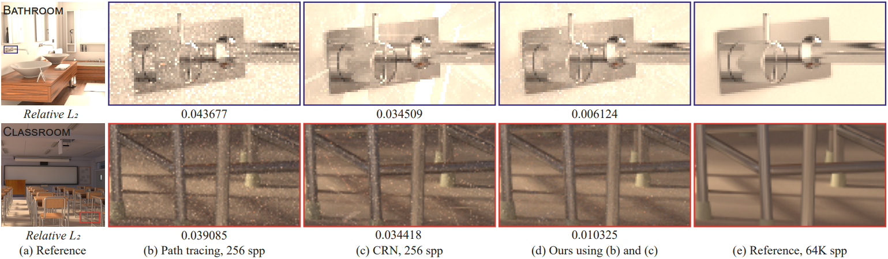

# [Input-Dependent Uncorrelated Weighting for Monte Carlo Denoising](https://cglab.gist.ac.kr/siga23iduw/)

[Jonghee Back](https://cglab.gist.ac.kr/people/)<sup>1</sup>, 
[Binh-Son Hua](https://sonhua.github.io/)<sup>2</sup>, 
[Toshiya Hachisuka](https://cs.uwaterloo.ca/~thachisu/)<sup>3</sup>, 
[Bochang Moon](https://cglab.gist.ac.kr/people/bochang.html)<sup>1</sup>

[GIST](https://www.gist.ac.kr/kr/main.html)<sup>1</sup>, 
[Trinity College Dublin](https://www.tcd.ie/)<sup>2</sup>, 
[University of Waterloo](https://uwaterloo.ca/)<sup>3</sup>




## Overview

This code is the official implementation of SIGGRAPH Asia 2023 paper, [Input-Dependent Uncorrelated Weighting for Monte Carlo Denoising](https://cglab.gist.ac.kr/siga23iduw/).
For more detailed information, please refer to our project page or other materials as below:

* [Project page](https://cglab.gist.ac.kr/siga23iduw/)
* [Paper](https://drive.google.com/file/d/1tjtUhFayfKRGUPjFfAc7QqtXWHNf8hvA/view?usp=sharing)
* [Supplementary report](https://drive.google.com/file/d/1sm-Fo8aG-PIUGUeV2Kc2q3eQWzeMTNzy/view?usp=sharing)
* [Interactive viewer](https://cglab-gist.github.io/input-dependent-uncorrelated-weighting-supp/index.html)


## Usage

### Running code

First, CMake, CUDA, OpenEXR and zlib are required to run the code. 
Please clone repositories for [OpenEXR](https://github.com/wjakob/openexr/tree/84793a726d77ad6cb9a510011c3907df809c32a4) and [zlib](https://github.com/mitsuba-renderer/zlib/tree/54d591eabf9fe0e84c725638f8d5d8d202a093fa) into `src/ext` folder and rename two folders to `openexr` and `zlib`, respectively.
After all dependencies are set, please use CMake as follows (or running CMake GUI):

```
mkdir build
cd build
cmake ..
```

After building the generated project, you can run the denoiser with some provided example data (refer to below) in the following manner:
```
./DenoiserTester test_scenes/input-crn test_scenes/reference bathroom crn 128
```

Please check the print message for more detailed usage:
```
./DenoiserTester -h
```

We have tested the code on machines with the following environments:

* Windows 10, Visual Studio 2019, CUDA 11.3
* Ubuntu 20.04, Clang 10.0.0, CUDA 11.6


### Example data

The example data consists of pairs of unbiased independent and correlated pixel estimates (common random number (CRN) and L2 reconstruction for gradient-domain rendering), rendered by [gradient-domain rendering framework](https://github.com/mmanzi/gradientdomain-mitsuba) on top of [Mitsuba](https://www.mitsuba-renderer.org/) renderer. The example data can be available here:

* [Example data (primal-domain)](https://drive.google.com/file/d/1ARXmJAJSyzn3GgStz35lYKe2dDL8G9X6/view?usp=sharing)
* [Example data (gradient-domain)](https://drive.google.com/file/d/14vxMr5fnQTYozGxdRsZd1TtGKgGv-iiN/view?usp=sharing)


## License

All source codes are released under a [BSD License](license).


## Citation

```
@inproceedings{Back23,
author = {Back, Jonghee and Hua, Binh-Son and Hachisuka, Toshiya and Moon, Bochang},
title = {Input-Dependent Uncorrelated Weighting for Monte Carlo Denoising},
year = {2023},
isbn = {9798400703157},
publisher = {Association for Computing Machinery},
address = {New York, NY, USA},
url = {https://doi.org/10.1145/3610548.3618177},
doi = {10.1145/3610548.3618177},
booktitle = {SIGGRAPH Asia 2023 Conference Papers},
articleno = {9},
numpages = {10},
keywords = {Monte Carlo denoising, unbiased denoising, input-dependent weighting, uncorrelated weighting},
location = {<conf-loc>, <city>Sydney</city>, <state>NSW</state>, <country>Australia</country>, </conf-loc>},
series = {SA '23}
}
```

## Contact

If there are any questions, issues or comments, please feel free to send an e-mail to [jongheeback@gm.gist.ac.kr](mailto:jongheeback@gm.gist.ac.kr).